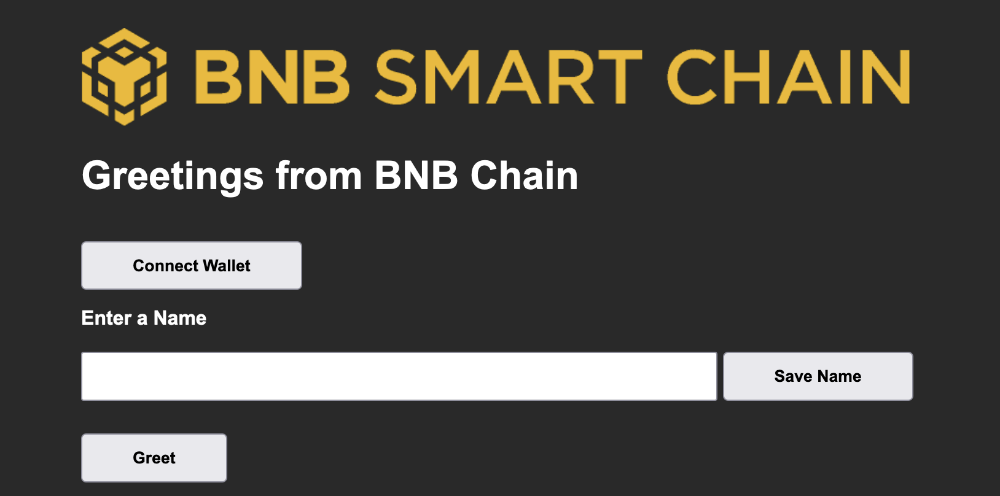

# Nodejs-Dapps-Demo
Use nodejs to build the frontend and backend for Dapps



## Overview
An easy-to-understand tutorial for newbies to develop smart contact on BNB Smart Chain. In this tutorial, we provide a step-by-step guide on how to develop a full-stack Hello World Smart dApp that is used for storing and retrieving data from the BSC blockchain. The technology stack used includes Solidity, Truffle, Ganache, Web3.js, and Node js. This smart contract is then deployed on the BNB Smart Chain Testnet.

## What You Will Learn
Through this tutorial, you will learn
* MetaMask Wallet connectivity to BSC Testnet;
* Smart-contract development;
* Using truffle and ganache for local development and testing;
* Unit testing of smart contracts;
* Deploying smart contracts on BSC Testnet;
* Front-end integration with smart contract using web3.js library;

## Target audience
This tutorial aims to provide adequate information to anyone who wants to learn dApp development on BNB Smart Chain.

## Prerequisites
* node -v 
   
   * v18.13.0
* npm -v
   
   * 8.19.3
* truffle version 
   
   * Truffle v5.7.4 (core: 5.7.4)
   * Ganache v7.7.3
   * Solidity - ^0.8.0 (solc-js)
   * Node v18.13.0
   * Web3.js v1.8.1
* Webpack
* MetaMask Wallet
   
   * v10.22.2

> Note: Avoid using Node v19 which may cause errors during the application start process.

## Setup
1. Clone the repository ```gh repo clone ZiyuanStar/Nodejs-Dapps-Demo```
2. Change the current directory ```cd Nodejs-Dapps-Demo```
3. Install all the dependencies (node modules): ```npm install```
4. Create a .secret file with the secret phrase of MetaMask. Refer here for details on how to get MetaMask secret phrase.
5. Compile Smart Contracts: ```truffle compile```
6. Migrate Smart Contracts: ```truffle migrate --reset --network bscTestnet```
7. Create build: ```npm run build```
8. Run the application: ```npm run dev```
>  Note: Make Sure Nothing is Running on localhost:3000

## Available Scripts
```
  $ truffle compile
  $ truffle migrate
  $ truffle test
  $ npm run build
  $ npm run dev
```

## Structure

```
HelloWorld.
|   .env
|   .gitattributes
|   LICENSE
|   package-lock.json
|   package.json
|   README.md
|   truffle-config.js
|   webpack.config.js
|   yarn.lock
| 
+---build
|   \---contracts
|           HelloWorld.json
|           Migrations.json
|           
+---client
|   |   app.js
|   |   chain-smart-bsc-l.png
|   |   index.css
|   |   index.html
|   |   
|           
+---contracts
|       HelloWorld.sol
|       Migrations.sol
|       
+---migrations
|       1_initial_migration.js
|       2_hello_world.js
|                 
+---server
|       main.js
|       
+---test
|       .gitkeep
|       hello_world.js       
|       
```

## How it Works
### Checklist

1. Make sure you have MetaMask installed and logged in on your browser.
2. Make sure that your MetaMask wallet is correctly configured to connect to BSC Testnet. Refer to this guide for details.
3. Create a file named .secret, save your MetaMask Secret Phrase in this file.
4. Run the command truffle compile to compile the smart contracts.
5. Run the command truffle migrate --reset --network bscTestnet to deploy the contract on the BSC Testnet.
6. Run the command npm run build to build the application.
7. Run the command npm run dev to start the application.

### How to Use

1. Open browser and navigate to http://localhost:3000/
2. Make sure that your MetaMask wallet is correctly installed and configured to connect to BSC Testnet. Refer to this guide for details.
3. Select your desired account of MetaMask that has BNB Test tokens to perform transactions.
4. To get test tokens use the BNB Smart Chain Faucet.
5. Click on Greet Button to display message, by default its Hello World.
6. Enter a name in the input field, Click save button to save the name.
7. Confirm the transaction when MetaMask notification pops up.
8. Click on Greet Button to display message along with the last name saved with the current account.

## Unit Test of Smart Contracts

* Make sure that Ganache is running. This is important because testing is done on the local network.
* From the root directory of the project, open command prompt.
* Run the command ```truffle test``` to run the tests.

## Unit Test Coverage

1. Install and run ganache-cli before executing the tests ```$ npm i ganache-cli --save-dev```
2. Add the following scripts to package.json file to run the ganache and test through npm:
```
"ganache": "ganache-cli -m 'need champion step tone example napkin key net grief fan focus repair'", //put your own mnemonic here.
"test": "truffle test"
```
3. Open two terminals inside the app directory and then first run the ganache-cli:
```$ npm run ganache```
In the second terminal, run the test file:
```$ npm run test```

The result of the above command should look like this:
```
  Contract: HelloWorld
    ✔ Default message should be hello, worldAttempt #1
    ✔ Should save name (50ms)from solc-bin. Attempt #1
    ✔ Should be default message for other accounts
    ✔ Should throw error on empty name (264ms)tempt #1
⠧ Fetching solc version list from solc-bin. Attempt #1

  4 passing (420ms)
```

## Tips

### Why do I get "Error: Could not find block" during contract compilation?

Please use node version before v19. You can download a sepecified version of node by installing nvm and running ```nvm install 18```

### Why do I get "opensslErrorStack" error when building the project?

If you get errors like below:
```
  opensslErrorStack: [ 'error:03000086:digital envelope routines::initialization error' ],
  library: 'digital envelope routines',
  reason: 'unsupported',
  code: 'ERR_OSSL_EVP_UNSUPPORTED'
```
Please run command ```export NODE_OPTIONS=--openssl-legacy-provider```


   
